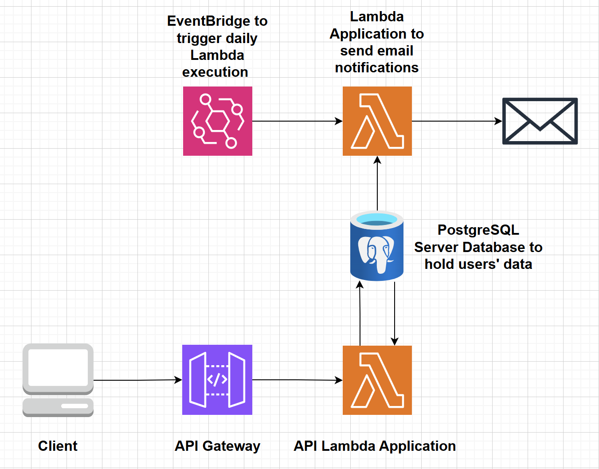

<h2>Table of contents:</h2>
<ul>
  <li><a href="#overview">Overview</a></li>
  <li><a href="#features">Features</a></li>
  <li><a href="#api-endpoints">API Endpoints</a></li>
  <li><a href="#database-schema">Database Schema</a></li>
  <li><a href="#authentication">Authentication</a></li>
  <li><a href="#example-usage">Example Usage</a></li>
  <li><a href="#request-response-examples">Request/Response Examples</a></li>
  <li><a href="#security-notes">Security Notes</a></li>
  <li><a href="#deployment">Deployment</a></li>
  <li><a href="#dependencies">Dependencies</a></li>
  <li><a href="#license">License</a></li>
</ul>

 
<h1>PART 1: THE API ARCHITECTURE</h1>
<h2>Overview</h2>

Here I am describing the architecture of Tasks API, a secure, stateless API for managing user tasks with JWT authentication, built using FastAPI and PostgreSQL, deployed as an AWS Lambda function with API Gateway.

 
<h2>Features</h2>
<ul>
  <li>User registration and authentication with JWT</li>
  <li>Password hashing and secure credential validation</li>
  <li>CRUD operations for user tasks</li>
  <li>User account management (email/password updates, notifications, deletion)</li>
  <li>PostgreSQL database integration</li>
  <li>Stateless architecture with JWT tokens</li>
  <li>AWS Lambda deployment with Mangum adapter</li>
</ul>

  

 
<h2>API Endpoints</h2>
<h3>User Management</h3>

| Method | Endpoint               | Description                            |
|--------|------------------------|----------------------------------------|
| POST   | `/users`               | Register a new user                    |
| POST   | `/token`               | Authenticate and get JWT token         |
| PUT    | `/users/email`         | Update user email                      |
| PUT    | `/users/password`      | Update user password                   |
| PUT    | `/users/notifications` | Toggle notifications                   |
| DELETE | `/users/delete`        | Delete user account                    |
 
<h3>Task Management</h3>

| Method | Endpoint                     | Description                      |
|--------|------------------------------|----------------------------------|
| GET    | `/tasks`                     | Get all user tasks               |
| POST   | `/tasks/new_task`            | Create new task                  |
| PUT    | `/tasks/{id}/description`    | Update task description          |
| PUT    | `/tasks/{id}/deadline`       | Update task deadline             |
| DELETE | `/tasks/{id}/delete`         | Delete specific task             |
 
<h2>Database Schema</h2>
<h3>Users Table</h3>

| Column         | Type      | Description                                 |
|----------------|-----------|---------------------------------------------|
| id (PK)        | Integer   | Auto-generated user ID                      |
| email          | String    | Unique email address                        |
| password       | String    | BCrypt-hashed password                      |
| notifications  | Integer   | Notification preference (0/1, default is 1) |
 
<h3>Tasks Table</h3>

| Column         | Type      | Description                                 |
|----------------|-----------|---------------------------------------------|
| id (PK)        | Integer   | Auto-generated task ID                      |
| user_id (FK)   | Integer   | Associated user ID                          |
| description    | String    | Task description (500 chars max)            |
| deadline       | Date      | Task deadline in YYYY-MM-DD format          |
 
<h2>Authentication</h2>

All endpoints except `/users` and `/token` require JWT authentication. Include the token in the Authorization header: <code>Authorization: Bearer [your_token]</code>

 
<h2>Example Usage</h2>

The FAST API automatically generated documentation

<h3>User registration</h3>
<pre><code>
  import requests
   
  url = "https://4mvvs3klti.execute-api.us-east-1.amazonaws.com/users"
  payload = {
      "email": "user@example.com",
      "password": "SecurePass123!"
  }
   
  response = requests.post(url, json=payload)
</code></pre>
 
<h3>Get Access Token</h3>
<pre><code>
  auth_url = "https://4mvvs3klti.execute-api.us-east-1.amazonaws.com/token"
  response = requests.post(auth_url, json=data)
  access_token = response.json()
</code></pre>
 
<h3>Create Task</h3>
<pre><code>
  task_url = "https://4mvvs3klti.execute-api.us-east-1.amazonaws.com/tasks/new_task"
   
  headers = {"Authorization": f"Bearer {access_token}"}
   
  task_data = {
      "description": "Complete project",
      "deadline": "2024-05-31"
  }
   
  response = requests.post(task_url, json=task_data, headers=headers)
</code></pre>
 
<h3>Get All Tasks</h3>
<pre><code>
  tasks_url = "https://4mvvs3klti.execute-api.us-east-1.amazonaws.com/tasks"
  response = requests.get(tasks_url, headers=headers)
</code></pre>
 
<h2>Request/Response Examples</h2>
<h3>User Registration Request</h3>
<pre><code>
  {
    "email": "user@example.com",
    "password": "SecurePass123!"
  } 
</code></pre>
 
<h3>User Registration Response</h3>
<pre><code>
  {
    "id": 1,
    "email": "user@example.com",
    "notifications": 1
  }
</code></pre>
 
<h3>Task Creation/Update Response</h3>
<pre><code>
  {
    "id": 1,
    "description": "Finish the CS homework",
    "deadline": "2025-01-09"
  }
</code></pre>

<h2>Security Notes</h2>
<ul>
  <li>
    Password requirements: 
    <ul>
      <li>Minimum 8 characters</li>
      <li>At least 1 uppercase letter</li>
      <li>At least 1 lowercase letter</li>
      <li>At least 1 digit</li>
      <li>At least 1 special character</li>
    </ul>
  </li>
  <li>All passwords are hashed with BCrypt</li>
  <li>JWT tokens expire after 30 minutes</li>
  <li>HTTPS enforced through API Gateway</li>
</ul>
 
<h2>Deployment</h2>

The API is deployed using:

<ul>
  <li>AWS Lambda for serverless execution</li>
  <li>API Gateway for HTTP routing</li>
  <li>PostgreSQL RDS for database storage</li>
  <li>Docker container packaging</li>
</ul>
 
<h2>Dependencies</h2>
<ul>
  <li>FastAPI</li>
  <li>SQLAlchemy</li>
  <li>Pydantic (for request/response models)</li>
  <li>Passlib (bcrypt)</li>
  <li>Python-JOSE (JWT)</li>
  <li>Mangum (AWS Lambda adapter)</li>
  <li>Psycopg2 (PostgreSQL adapter)</li>
</ul>
 
<h2>License</h2>

This project is licensed under the MIT License - see the LICENSE file for details.

 

Note: for more information, access FastApi's automatically created documentation at "https://4mvvs3klti.execute-api.us-east-1.amazonaws.com/docs"

